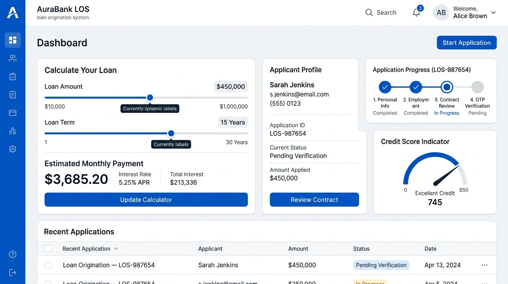
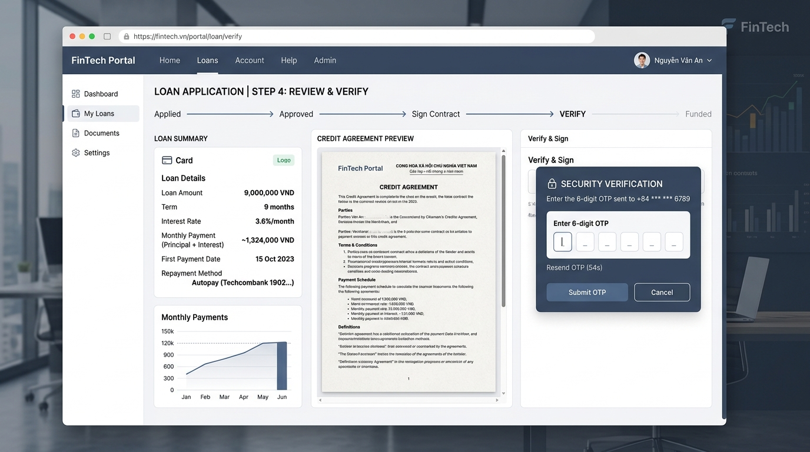

# 🏦 Loan Origination System (LOS)

<p align="center">
  
  
  
  
  
  
</p>

Hệ thống thẩm định và quản lý khoản vay trực tuyến toàn diện, tích hợp giữa **Web Portal khách hàng** (React 19 + Tailwind CSS) và **Core thẩm định tín dụng tự động** (Spring Boot 3 + MySQL).

---

## ⚡ Tính Năng Chính

* **Dự toán khoản vay thông minh**: Tùy chỉnh hạn mức (3 - 100 triệu VNĐ) và kỳ hạn, tự động tính lãi suất cố định cùng số tiền trả góp hàng tháng theo dư nợ giảm dần.
* **Đăng ký hồ sơ vay trực tuyến**: Thu thập thông tin định danh (CCCD), nghề nghiệp, mức thu nhập và người tham chiếu khẩn cấp qua biểu mẫu đa bước có kiểm tra dữ liệu chặt chẽ.
* **Tự động sinh hợp đồng**: Kết xuất hợp đồng tín dụng và đơn đề nghị vay vốn đúng chuẩn biểu mẫu pháp lý, hỗ trợ xem trước và tải file PDF trực tiếp trên trình duyệt.
* **Ký hợp đồng bằng mã OTP**: Gửi mã xác thực 6 chữ số đến email người vay qua dịch vụ Gmail SMTP TLS để hoàn tất ký kết hồ sơ.
* **Thẩm định tín dụng tự động (Underwriting Engine)**: Tự động chấm điểm hồ sơ theo ma trận nghề nghiệp/thu nhập và kiểm tra tỷ lệ nợ trên thu nhập (DTI $\le 60\%$) để ra quyết định tức thì (`APPROVED` hoặc `REJECTED`).
* **Tra cứu hồ sơ thời gian thực**: Khách hàng tra cứu toàn bộ lịch sử khoản vay theo số CCCD với timeline trực quan (*Tiếp nhận ➔ Thẩm định & Chấm điểm ➔ Phê duyệt / Từ chối*).
* **Bảo mật chuẩn Ngân hàng**: Xác thực người dùng bằng Spring Security 6 và JWT, kết hợp cơ chế Access/Refresh Token an toàn qua HttpOnly Cookie.

---

## 📸 Giao Diện Hệ Thống (UI Previews)

### 1. Dashboard & Dự toán Khoản vay


### 2. Xem xét Hợp đồng Tín dụng & Xác thực Ký số OTP


---

## 🛠 Công Nghệ Sử Dụng

| Phân hệ | Công nghệ chính |
| :--- | :--- |
| **Frontend Portal** | React 19, TypeScript, Vite, Tailwind CSS 4, Lucide Icons, jsPDF, html-to-image |
| **Backend Service** | Java 21, Spring Boot 3.5, Spring Data JPA, Hibernate, Spring Security 6, Nimbus JOSE JWT |
| **Cơ sở dữ liệu** | MySQL 8.x |
| **Dịch vụ Email** | Spring Mail (Gmail SMTP TLS) gửi mã OTP |
| **Công cụ Build & Chạy** | Maven Wrapper (`mvnw`), npm, PowerShell Scripts (`build-demo.ps1`, `run-demo.ps1`) |

---

## 📁 Cấu Trúc Dự Án

```text
Loan-Origination-System-Portal/
├── los-portal/           # Phân hệ Frontend Web Portal (React 19 + TypeScript + Vite)
│   ├── src/components/   # HomePage, ApplicationPage, LookupPage, AccountPage
│   └── src/services/     # Tầng gọi API kết nối Backend
├── los-backend/          # Phân hệ Backend Service (Spring Boot 3 + Java 21 + MySQL)
│   ├── src/main/java/    # Controller, Service, Entity, Repository, Security
│   └── src/main/resources/static/ # File build Portal sau khi đóng gói All-in-One
├── MySQL/                # Cơ sở dữ liệu
│   └── init_schema.sql   # Kịch bản DDL & DML khởi tạo bảng & dữ liệu mẫu
├── docs/images/          # Hình ảnh giao diện minh họa
├── build-demo.ps1        # Script tự động đóng gói cả Portal và Backend thành 1 file JAR
├── run-demo.ps1          # Script 1-click khởi chạy toàn bộ hệ thống
└── .gitignore            # Cấu hình bỏ qua các file nhạy cảm và build artifacts
```

---

## 🚀 Hướng Dẫn Khởi Chạy Nhanh

### 1. Chuẩn bị
* **Java 21+**, **Node.js 18+**, **MySQL Server** (đang chạy ở cổng 3306).
* Chạy file `MySQL/init_schema.sql` để khởi tạo database `los`.
* Cấu hình mật khẩu DB và email trong file `los-backend/.env` (tạo từ `.env.example`).

### 2. Khởi chạy All-In-One (Khuyên dùng)
Đóng gói giao diện React vào Spring Boot JAR và chạy duy nhất một tiến trình trên cổng 8080:
```powershell
# 1. Đóng gói chung cả Portal và Backend (nếu chưa có file JAR)
.\build-demo.ps1

# 2. Khởi chạy hệ thống (tự động mở http://localhost:8080)
.\run-demo.ps1
```

### 3. Khởi chạy chế độ Dev song song (Live-reload)
```powershell
# Khởi chạy đồng thời cả Backend (Port 8080) và Portal Frontend (Port 3000):
.\run-demo.ps1 -Dev
```

---

## 📤 Hướng Dẫn Đẩy Lên GitHub

```bash
# 1. Khởi tạo kho lưu trữ git (nếu chưa có)
git init

# 2. Kiểm tra các file sẽ commit (đã có .gitignore loại trừ .env, target/, node_modules/)
git status

# 3. Thêm toàn bộ mã nguồn vào staging
git add .

# 4. Tạo commit đầu tiên
git commit -m "feat: initial commit for Loan Origination System (Portal + Backend)"

# 5. Liên kết tới remote repository trên GitHub
git remote add origin https://github.com/<tai-khoan-cua-ban>/Loan-Origination-System-Portal.git

# 6. Đổi nhánh chính sang main và push
git branch -M main
git push -u origin main
```
